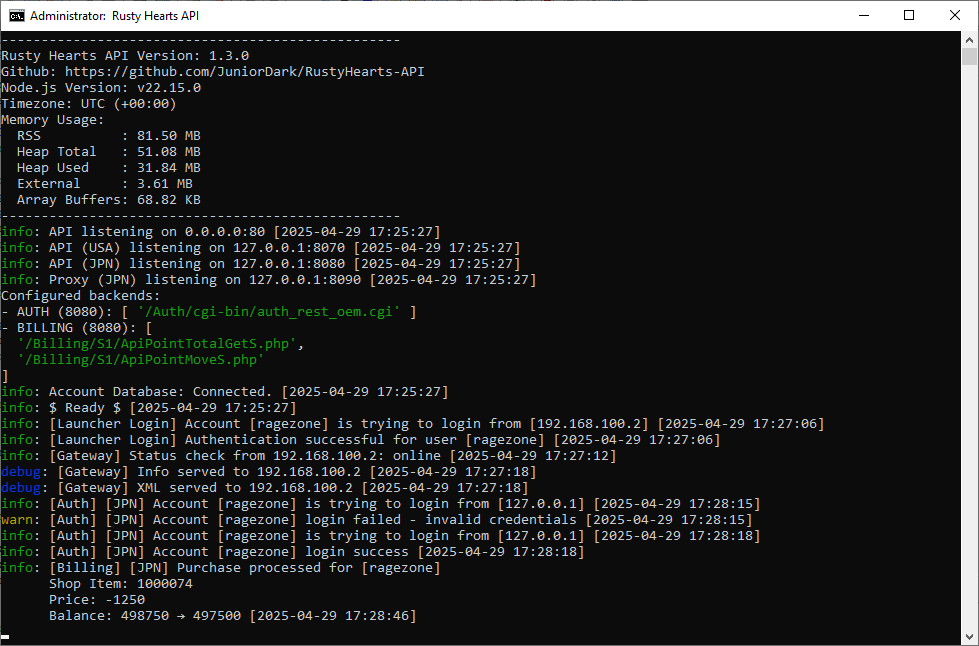

# RustyHearts-API

RustyHearts-API is a Node.js-based REST API that enables authentication, billing, and launcher functionalities for Rusty Hearts.

The API consists of three independent servers (Auth API, Billing API and Launcher API) running on different ports.

## Getting Started

Either use `git clone https://github.com/JuniorDark/RustyHearts-API` on the command line to clone the repository or use Code --> Download zip button to get the files.

### Preview

### API region support
The api currently only support the **usa** (PWE) region.

* **usa** (PWE) - Full api support
* **chn** (Xunlei) - Only launcher support

## Server Descriptions

- The Auth API is responsible for in-game authentication, while the Billing API manages the shop's zen balance and purchases. It is essential to bind the Auth/Billing API only to a local IP address and prevent external access to these APIs.
- The Launcher API is a web server intended to handle the client connection to the gateserver and for the [Rusty Hearts Launcher](https://github.com/JuniorDark/RustyHearts-Launcher), which handles registration, login, client updates, and processing static elements (public directory). This API must be accessible from the outside and proxied by Nginx or bound to an external IP.

## Table of Contents
* [Preview](#preview)
* [Public folder](#public-folder-description)
* [Requirements](#requirements)
* [Deployment](#deployment)
* [Basic Installation](#basic-installation)
* [.env file setup](#env-file-setup)
* [Available endpoints](#available-endpoints)
* [License](#license)

## Public folder description

### Launcher self-update

In order for the launcher to automatically update itself, you need to use the launcher_info.ini in the `launcher_update` directory of the api. This file specifies the version of the launcher. After each update of the launcher, you need to change the version in the ini, as well in the launcher executable file.

### Client download

In order to create client download, you need to use the `client` directory of the api.
The tool for creating the client files is available in the repository: https://github.com/JuniorDark/RustyHearts-MIPTool

### Client patch

In order to create client patches, you need to use the `patch` directory of the api.
The tool for creating the patch files is available in the repository: https://github.com/JuniorDark/RustyHearts-MIPTool

### News panel
Used to display the html page in the [Rusty Hearts Launcher](https://github.com/JuniorDark/RustyHearts-Launcher), uses the `news` directory of the api

## Requirements

Before deploying RustyHearts-API, ensure that you have the following software installed:

* [Node.js](https://nodejs.org/en/) version 18.5.0 or higher
* [Microsoft SQL Server](https://go.microsoft.com/fwlink/p/?linkid=2215158) version 2019 or 2022 Developer edition
* [Rusty Hearts Retail Server](https://forum.ragezone.com)

## Deployment

To deploy RustyHearts-API, follow these steps:

### Basic Installation

1. Install the latest version of Node.js from the [official website](https://nodejs.org/).
2. Download or clone the repository and copy all RustyHearts-API files to a directory of your choice (e.g., **c:\RustyHearts-API**).
3. Open a terminal window, navigate to the RustyHearts-API directory, and execute the `npm install` command. Alternatively, you can run the **install.bat** file.
4. Import the [database file](share/RustyHearts_Account.sql) to your Microsoft SQL Server.
5. Configure the parameters in the [**.env**](.env) file.
6. Start RustyHearts-API servers by executing the `node src/app` command or running the **rh-api.bat** file.
7. The server region must be set to **usa** on [service_control.xml](share/service_control.xml)

## .env file setup:

### API CONFIGURATION

- **PORT**: The port number for receiving connections (default 3000).
- **AUTH_PORT**: The port number for the Auth API.
- **BILLING_PORT**: The port number for the Billing API.
- **ENABLE_HELMET**: Determines whether the helmet middleware is enabled or disabled. If enabled, https need to be used for the api.
- **TZ**: The timezone for the server.

### LOGGING CONFIGURATION

- **LOG_LEVEL**: The level of logging to use (e.g. debug, info, warn, error).
- **LOG_AUTH_CONSOLE**: Whether to log Auth API messages to the console.
- **LOG_BILLING_CONSOLE**: Whether to log Billing API messages to the console.
- **LOG_ACCOUNT_CONSOLE**: Whether to log Account API messages to the console.
- **LOG_MAILER_CONSOLE**: Whether to log email messages to the console.

### DATABASE CONFIGURATION

- **DB_SERVER**: The IP address or hostname of the SQL Server.
- **DB_DATABASE**: The name of the database to connect to (RustyHearts_Account).
- **DB_USER**: The user to connect to the database.
- **DB_PASSWORD**: The password for the database user.
- **DB_ENCRYPT**: Whether to encrypt the connection to the database.

### GATEWAY API CONFIGURATION

- **GATESERVER_IP**: The IP address of the gate server.
- **GATESERVER_PORT**: The port number of the gate server.

### EMAIL CONFIGURATION

- **SMTP_HOST**: The hostname or IP address of the SMTP server.
- **SMTP_PORT**: The port number of the SMTP server.
- **SMTP_ENCRYPTION**: The encryption protocol to use (e.g. ssl, tls).
- **SMTP_USERNAME**: The username for the SMTP server.
- **SMTP_PASSWORD**: The password for the SMTP server.
- **SMTP_FROMNAME**: The name to use as the sender in emails.

## Available endpoints

The api provides the following endpoints:

Endpoint | Method | Arguments | Description
--- | --- | --- | ---
/serverApi/auth | POST | XML with account, password, game and IP | Authenticates a user game login based on their account information and sends an XML response with their user ID, user type, and success status. If authentication fails, it sends an XML response with a failure status.
/serverApi/billing | POST | XML with currency-request or item-purchase-request and associated arguments | Handles billing requests. For currency requests, it retrieves the user's Zen balance from the database and sends an XML response with the balance. For item purchase requests, it deducts the cost of the item from the user's Zen balance and logs the transaction in the database. If the transaction is successful, it sends an XML response with the success status. If the transaction fails, it sends an XML response with a failure status and an error message.
/serverApi/gateway | GET |  | Returns an XML response containing the IP address and port number of the gateway server.
/serverApi/gateway/info | GET |  | Returns an response containing the gateway endpoint. Used by the **chn** region.
/serverApi/gateway/status | GET |  | Checks the status of the gateway server by attempting to establish a connection to the server. Returns a JSON object with the status of the server (online or offline) and an HTTP status code indicating the success or failure of the connection attempt.
/accountApi/register | POST | windyCode, email, password | Create a new account with the provided windyCode, email, and password. The password is first combined with the windyCode to create an MD5 hash, which is then salted and hashed again using bcrypt before being stored in the database. An email confirmation is sent to the provided email address, and a success or error message is returned.
/accountApi/login | POST | account, password | Authenticates a user account in the launcher by username or email address and password. Return a token if the authentication is successful (token is currently unsued).
/accountApi/codeVerification | POST | email, verification_code_type, verification_code | Verify a user's email by checking the verification code
/accountApi/sendPasswordResetEmail | POST | email | Sends an email with a password reset verification code to the specified email address
/accountApi/changePassword | POST | email, password, verification_code | Change the password of a user's account, given the email and password verification code 
/accountApi/sendVerificationEmail | POST | email | Sends a verification email to the specified email address.
/launcherApi/launcherUpdater/getLauncherVersion | GET |  | Returns the version of the launcher by reading the launcher_info.ini file.
/launcherApi/launcherUpdater/updateLauncherVersion | POST | version | Download the specified launcher versionr from the launcher_update folder.
/serverApi/onlineCount | GET |  | Returns the number of online players. Returns a JSON object with the count.

## License
This project is licensed under the terms found in [`LICENSE-0BSD`](LICENSE).
